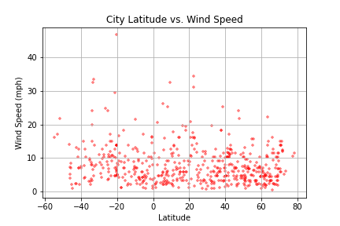
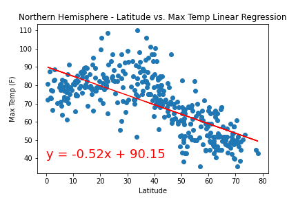
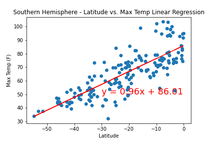
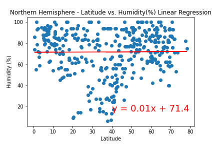
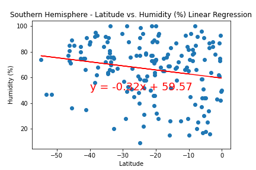
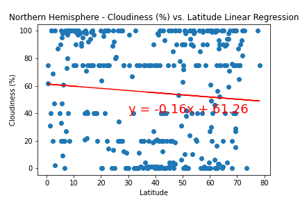
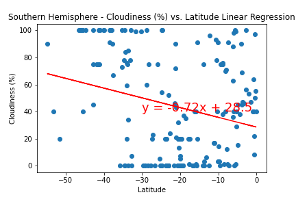
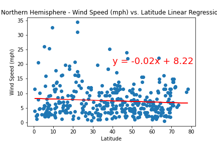
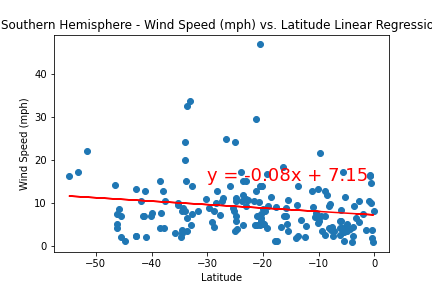

# WeatherPy

Creating a Python script to visualize the weather of 500+ cities across the world of varying distance from the equator, utilizing a [simple Python library](https://pypi.python.org/pypi/citipy), the [OpenWeatherMap API](https://openweathermap.org/api), and a little common sense to create a representative model of weather across world cities.

* Randomly selected 500 unique (non-repeat) cities based on latitude and longitude.
* Performed a weather check on each of the cities using a series of successive API calls.
* Included a print log of each city as it's being processed with the city number and city name.
* Saved a CSV of all retrieved data and a PNG image for each scatter plot.

### Scatter Plots

* Temperature (F) vs. Latitude

    
* Humidity (%) vs. Latitude

    
* Cloudiness (%) vs. Latitude

    
* Wind Speed (mph) vs. Latitude

    

### Linear Regression Plots

* Northern Hemisphere - Temperature (F) vs. Latitude

    

* Southern Hemisphere - Temperature (F) vs. Latitude

    
* Northern Hemisphere - Humidity (%) vs. Latitude

    
* Southern Hemisphere - Humidity (%) vs. Latitude

    
* Northern Hemisphere - Cloudiness (%) vs. Latitude

    
* Southern Hemisphere - Cloudiness (%) vs. Latitude

    
* Northern Hemisphere - Wind Speed (mph) vs. Latitude

    
* Southern Hemisphere - Wind Speed (mph) vs. Latitude

    
